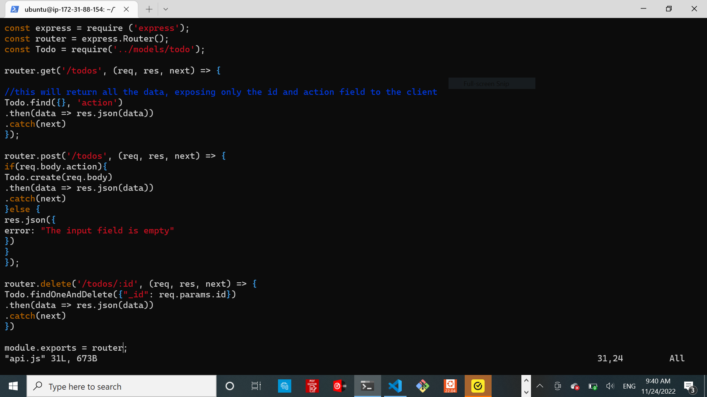
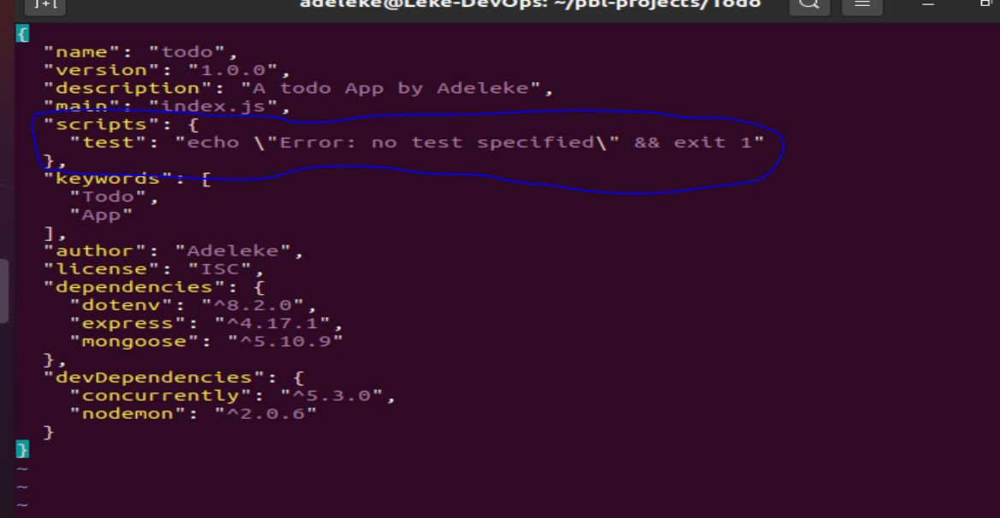

 
 # PROJECT 3: MERN STACK IMPLEMENTATION
---

**Table of Content**

[**STEP 1 – BACKEND CONFIGURATION**](#step-1-–-backend-configuration)

[**1. Install NODE.JS and NPM on the server**](#1-install-nodejs-and-npm-on-the-serve)

  1. Install Node.js and npm on the serve

  2. Initialise the application
  
  [**2. Install EXPRESSJS**](#2-install-expressjs)

  1. Install the dotenv module

  2. Create ROUTES

  3. Create MODELS
  
  [**3. MONGODB DATABASE**](#3-mongodb-database)

  1. Create a mongoDB cluster
  2. Connecte to MongoDB

  [**4. Testing Backend Code using RESTful API**](#4-testing-backend-code-without-frontend-using-restful-api)

---

[**STEP 2 – FRONTEND CREATION**](#step-2-–-frontend-creation)

  [**1. Install REACT**](#1-install-react)
      
  -  Install concurrently
  -  Install nodemon
  
  [**2. Configure Proxy in package.json**](#2-configure-proxy-in-packagejson)

  [**3. Create REACT COMPONENTS**](#3-creating-react-components)

  [**4. Install Axios**](#4-install-axios)

 [**Links**](#links)

-----
---


## **STEP 1 – BACKEND CONFIGURATION**

---
## **1. Install Node.js and npm on the serve**


Update ubuntu

`sudo apt update`

Upgrade ubuntu

`sudo apt upgrade`

Lets get the location of Node.js software from Ubuntu repositories.


`curl -fsSL https://deb.nodesource.com/setup_18.x | sudo -E bash -`

  ### 1.  **Install Node.js and npm on the serve**

    `sudo apt-get install -y nodejs`

      
Verify the node installation with the command below

`node -v` 


Verify the node installation with the command below

`npm -v`


### 2. **Initialise the application**

    -Create a new directory for your To-Do project:

`mkdir Todo`

-init to initialise your project

`cd Todo`

`npm init`


[Back to top](#project-3-mern-stack-implementation)

---
## 2. **INSTALL EXPRESSJS**

`npm install express`


-Now create a file index.js with the command below

`touch index.js`
 
1.  ### **Install the `dotenv` module**

`npm install dotenv`


- populate `index.js` file
  
  Open the index.js file with the command below

`vim index.js`

```py
const express = require('express');
require('dotenv').config();

const app = express();

const port = process.env.PORT || 5000;

app.use((req, res, next) => {
res.header("Access-Control-Allow-Origin", "\*");
res.header("Access-Control-Allow-Headers", "Origin, X-Requested-With, Content-Type, Accept");
next();
});

app.use((req, res, next) => {
res.send('Welcome to Express');
});

app.listen(port, () => {
console.log(`Server running on port ${port}`)
});
```


-  Start node on the server

`node index.js`


- open port 5000 on EC2


- Access the server in the browser

`http://<PublicIP-or-PublicDNS>:500`


## 2. **Create ROUTES**

There are three actions that our To-Do application needs to be able to do:

1. Create a new task
1. Display list of all tasks
1. Delete a completed task

Each task will be associated with some particular endpoint and will use different standard HTTP request methods: `POST`, `GET`, `DELETE`.

- Create a routes directory
  
  `mkdir routes`

- Now, create a file `api.js` in the routes   directory

`cd routes`

`touch api.js`

- Populate api.js file
  
  `vim api.js`

```py
const express = require ('express');
const router = express.Router();

router.get('/todos', (req, res, next) => {

});

router.post('/todos', (req, res, next) => {

});

router.delete('/todos/:id', (req, res, next) => {

})

module.exports = router;

```

## 3. **Create MODELS**

-  install mongoose 
  
  `npm install mongoose`

  

- Create a new folder models :

mkdir models

- create a file named `todo`.js inside the models directory
  
  `mkdir models && cd models && touch todo.js`

- populate the todo.js file with:
  
  `vim todo.js`

```py
const mongoose = require('mongoose');
const Schema = mongoose.Schema;

//create schema for todo
const TodoSchema = new Schema({
action: {
type: String,
required: [true, 'The todo text field is required']
}
})

//create model for todo
const Todo = mongoose.model('todo', TodoSchema);

module.exports = Todo;

```


-  update our routes from the file 
  `api.js`
  
  populate api.js in the routes diredtory with

  `vim api.js`


```py
const express = require ('express');
const router = express.Router();
const Todo = require('../models/todo');

router.get('/todos', (req, res, next) => {

//this will return all the data, exposing only the id and action field to the client
Todo.find({}, 'action')
.then(data => res.json(data))
.catch(next)
});

router.post('/todos', (req, res, next) => {
if(req.body.action){
Todo.create(req.body)
.then(data => res.json(data))
.catch(next)
}else {
res.json({
error: "The input field is empty"
})
}
});

router.delete('/todos/:id', (req, res, next) => {
Todo.findOneAndDelete({"_id": req.params.id})
.then(data => res.json(data))
.catch(next)
})

module.exports = router;

```



[Back to top](#project-3-mern-stack-implementation)

---
## 3. **MONGODB DATABASE**
    
  ### **1 - Create a mongoDB cluster**
  
  

  ### **2 -Connecte to MongoDB**

  - Create a file in  `Todo directory` and name it `.env`


```
touch .env
vi .env
```

Add the connection string to access the database in it, just as below:

DB = 'mongodb+srv://<username>:<password>@<network-address>/<dbname>?retryWrites=true&w=majority'

Ensure to update <username>, <password>, <network-address> and <database> according to your setup


- update the `index.js `file
  
  Now, paste the entire code below in the  index.js file.

`vi index.js`

```py
const express = require('express');
const bodyParser = require('body-parser');
const mongoose = require('mongoose');
const routes = require('./routes/api');
const path = require('path');
require('dotenv').config();

const app = express();

const port = process.env.PORT || 5000;

//connect to the database
mongoose.connect(process.env.DB, { useNewUrlParser: true, useUnifiedTopology: true })
.then(() => console.log(`Database connected successfully`))
.catch(err => console.log(err));

//since mongoose promise is depreciated, we overide it with node's promise
mongoose.Promise = global.Promise;

app.use((req, res, next) => {
res.header("Access-Control-Allow-Origin", "\*");
res.header("Access-Control-Allow-Headers", "Origin, X-Requested-With, Content-Type, Accept");
next();
});

app.use(bodyParser.json());

app.use('/api', routes);

app.use((err, req, res, next) => {
console.log(err);
next();
});

app.listen(port, () => {
console.log(`Server running on port ${port}`)
});
```

Start the server using the command:

`node index.js`


[Back to top](#project-3-mern-stack-implementation)

 --- 
## 4. **Testing Backend Code without Frontend using RESTful API**
   
  
  Testing  End Eoints:

Add a new task to the list – HTTP POST request

Display a list of tasks – HTTP GET request

Delete an existing task from the list – HTTP DELETE request

Now open your `Postman`, create a `POST` request to the API `http://<PublicIP-or-PublicDNS>:5000/api/todos`.

Set header:  Key to Content-Type  and value as  application/json


Create a GET request to the API on `http://<PublicIP-or-PublicDNS>:5000/api/todos`.


Delete a request:

first Create a GET request to the API on `http://<PublicIP-or-PublicDNS>:5000/api/todos`. and get the request `id` to be deleted

Next select a DeLETE request to the API on
` http://<PublicIP-or-PublicDNS>:5000/api/todos/id`


[Back to top](#project-3-mern-stack-implementation)

---
---
# **STEP 2 – FRONTEND CREATION**

Create a user interface for a Web client (browser) to interact with the application via API

  ## 1. **install React**
  
   `npx create-react-app client`

   

   - Running a React App

Before testing the react app, there are some dependencies that need to be installed.

Install `concurrently`. It is used to run more than one command simultaneously from the same terminal window.

`npm install concurrently --save-dev`


Install nodemon. It is used to run and monitor the server. If there is any change in the server code, nodemon will restart it automatically and load the new changes.

`npm install nodemon --save-dev`


In `Todo` folder open the `package.json` file. Change the highlighted part of the below screenshot and replace with the code below.



`vi package.json`

```py
"scripts": {
"start": "node index.js",
"start-watch": "nodemon index.js",
"dev": "concurrently \"npm run start-watch\" \"cd client && npm start\""
},

```


## 2. **Configure Proxy in package.json**

Change directory to ‘client’

`cd client`

Open the package.json file

`vi package.json`

Add the key value pair in the package.json file

 `"proxy": "http://localhost:5000"`

The whole purpose of adding the proxy configuration is to make it possible to access the application directly from the browser by simply calling the server url like 
`http://localhost:5000` rather than always including the entire path like `http://localhost:5000/api/todos`


Now, ensure you are inside the Todo directory, and simply do:

`npm run dev`


The application is started and running on `localhost:3000`


- open TCP port 3000 on EC2 by adding a new Security Group rule to allow access in browser.


## 3. **Creating React Components**
  `cd client`

    Move to the src directory inside client directory

`cd src`

Inside your `src` folder create another folder called components

`mkdir components`

`cd components`

Inside `components` directory create three files Input.js, ListTodo.js and Todo.js.

`touch Input.js ListTodo.js Todo.js`


Open `Input.js` file

`vi Input.js`

Copy and paste the following

```py
import React, { Component } from 'react';
import axios from 'axios';

class Input extends Component {

state = {
action: ""
}

addTodo = () => {
const task = {action: this.state.action}

    if(task.action && task.action.length > 0){
      axios.post('/api/todos', task)
        .then(res => {
          if(res.data){
            this.props.getTodos();
            this.setState({action: ""})
          }
        })
        .catch(err => console.log(err))
    }else {
      console.log('input field required')
    }

}

handleChange = (e) => {
this.setState({
action: e.target.value
})
}

render() {
let { action } = this.state;
return (
<div>
<input type="text" onChange={this.handleChange} value={action} />
<button onClick={this.addTodo}>add todo</button>
</div>
)
}
}

export default Input
```


## 4. **Install Axios**

To make use of `Axios`, which is a Promise based HTTP client for the browser and node.js, you need to cd into your client from your terminal and run yarn add axios or npm install axios.

Move to the `src` folder

`cd ..`

Move to clients folder

`cd ..`

Install Axios

`npm install axios`


Go to `components` directory

`cd src/components`

Open ListTodo.js

`vi ListTodo.js`

in the ListTodo.js copy and paste the following code

```py
import React from 'react';

const ListTodo = ({ todos, deleteTodo }) => {

return (
<ul>
{
todos &&
todos.length > 0 ?
(
todos.map(todo => {
return (
<li key={todo._id} onClick={() => deleteTodo(todo._id)}>{todo.action}</li>
)
})
)
:
(
<li>No todo(s) left</li>
)
}
</ul>
)
}

export default ListTodo

```


Then in the Todo.js file you write the following code:

`vi Todo.js`

```py
import React, {Component} from 'react';
import axios from 'axios';

import Input from './Input';
import ListTodo from './ListTodo';

class Todo extends Component {

state = {
todos: []
}

componentDidMount(){
this.getTodos();
}

getTodos = () => {
axios.get('/api/todos')
.then(res => {
if(res.data){
this.setState({
todos: res.data
})
}
})
.catch(err => console.log(err))
}

deleteTodo = (id) => {

    axios.delete(`/api/todos/${id}`)
      .then(res => {
        if(res.data){
          this.getTodos()
        }
      })
      .catch(err => console.log(err))

}

render() {
let { todos } = this.state;

    return(
      <div>
        <h1>My Todo(s)</h1>
        <Input getTodos={this.getTodos}/>
        <ListTodo todos={todos} deleteTodo={this.deleteTodo}/>
      </div>
    )

}
}

export default Todo;
```


To Delete the logo and adjust our App.js:

Move to the `src` folder

`cd ..`
Make sure that you are in the `src `folder and run

`vi App.js`

Copy and paste the code below into it

```py
import React from 'react';

import Todo from './components/Todo';
import './App.css';

const App = () => {
return (
<div className="App">
<Todo />
</div>
);
}

export default App;
```


After pasting, exit the editor.

In the `src` directory open the App.css

`vi App.css`

Then paste the following code into App.css:

```py
.App {
text-align: center;
font-size: calc(10px + 2vmin);
width: 60%;
margin-left: auto;
margin-right: auto;
}

input {
height: 40px;
width: 50%;
border: none;
border-bottom: 2px #101113 solid;
background: none;
font-size: 1.5rem;
color: #787a80;
}

input:focus {
outline: none;
}

button {
width: 25%;
height: 45px;
border: none;
margin-left: 10px;
font-size: 25px;
background: #101113;
border-radius: 5px;
color: #787a80;
cursor: pointer;
}

button:focus {
outline: none;
}

ul {
list-style: none;
text-align: left;
padding: 15px;
background: #171a1f;
border-radius: 5px;
}

li {
padding: 15px;
font-size: 1.5rem;
margin-bottom: 15px;
background: #282c34;
border-radius: 5px;
overflow-wrap: break-word;
cursor: pointer;
}

@media only screen and (min-width: 300px) {
.App {
width: 80%;
}

input {
width: 100%
}

button {
width: 100%;
margin-top: 15px;
margin-left: 0;
}
}

@media only screen and (min-width: 640px) {
.App {
width: 60%;
}

input {
width: 50%;
}

button {
width: 30%;
margin-left: 10px;
margin-top: 0;
}
}
```
Exit


In the src directory open the index.css

`vim index.css`

Copy and paste the code below:
```py
body {
margin: 0;
padding: 0;
font-family: -apple-system, BlinkMacSystemFont, "Segoe UI", "Roboto", "Oxygen",
"Ubuntu", "Cantarell", "Fira Sans", "Droid Sans", "Helvetica Neue",
sans-serif;
-webkit-font-smoothing: antialiased;
-moz-osx-font-smoothing: grayscale;
box-sizing: border-box;
background-color: #282c34;
color: #787a80;
}

code {
font-family: source-code-pro, Menlo, Monaco, Consolas, "Courier New",
monospace;
}
```

Go to the `Todo` directory

`cd ../..`

Back the Todo directory and run:

`npm run dev`


[Back to top](#project-3-mern-stack-implementation)

-

## **Links**
---
[*Install Open ssh Server*](https://learn.microsoft.com/en-us/windows-server/administration/openssh/openssh_install_firstuse?tabs=gui)

[*Open ssh key management*](https://learn.microsoft.com/en-us/windows-server/administration/openssh/openssh_keymanagement?source=recommendations)

[*Markdown guide*](https://www.markdownguide.org/cheat-sheet)

[Windows VS-code Git and windows terminal installation-part1](https://www.youtube.com/watch?v=R-qcpehB5HY&t=0s)

[Windows VS-code Git and windows terminal installation-part2](https://www.youtube.com/watch?v=jsNIlK5s6pI)

[Learn to code](https://www.w3schools.com/)

[Back to top](#project-3-mern-stack-implementation)
